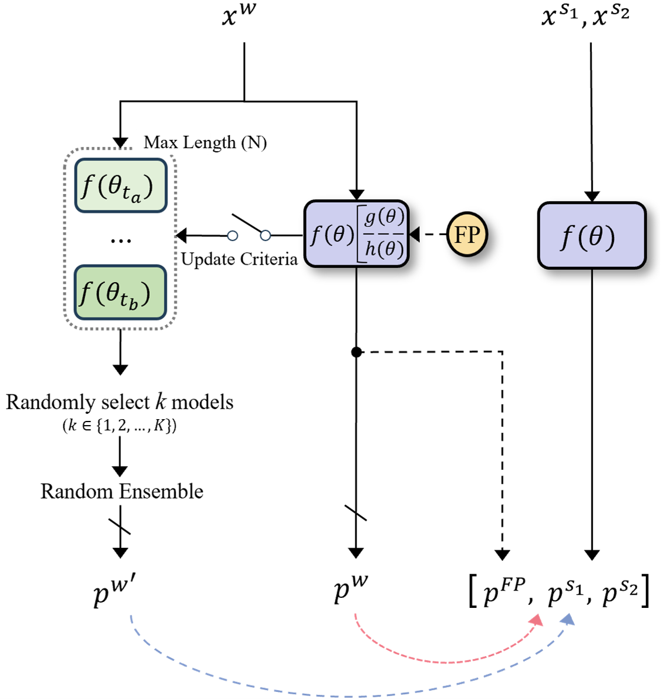

# PrevMatch: Revisiting and Maximizing Temporal Knowledge in Semi-supervised Semantic Segmentation


This is the official PyTorch implementation for the paper "Revisiting and Maximizing Temporal Knowledge in Semi-supervised Semantic Segmentation".

**[Arxiv]**


## Overview
description




## Main Results

### Pascal VOC 2012
**Original protocol** whereby labeled images are exclusively sourced from the high-quality subset.
The ( ) indicates the performance of the provided checkpoints.

| ResNet-50 & DeepLabV3+      |  92  | 183  | 366  | 732  | 1464 |
| :-------------------------: | :--: | :--: | :--: | :--: | :--: |
| Supervised Baseline         | 44.0 | 52.3 | 61.7 | 66.7 | 72.9 |
| UniMatch     (CVPR'23)      | 71.9 | 72.5 | 76.0 | 77.4 | 78.7 |
| Dual Teacher (NIPS'23)      | 70.8 | 74.5 | 76.4 | 77.7 | 78.2 |
| **PrevMatch (ours)**        | 73.4 <br> (73.7) | 75.4 <br> (75.9) | 77.5 <br> (78.0) | 78.6 | 79.3 <br> (79.6)|

| ResNet-101 & DeepLabV3+     |  92  | 183  | 366  | 732  | 1464 |
| :-------------------------: | :--: | :--: | :--: | :--: | :--: |
| Supervised Baseline         | 45.1 | 55.3 | 64.8 | 69.7 | 73.5 |
| AugSeg     (CVPR'23)        | 71.1 | 75.5 | 78.8 | 80.3 | 81.4 |
| UniMatch   (CVPR'23)        | 75.2 | 77.2 | 78.8 | 79.9 | 81.2 |
| **PrevMatch (ours)**        | 77.0 <br> (76.9) | 78.5 <br> (79.0) | 79.6 <br> (79.8) | 80.4 | 81.6 |


### Cityscapes
| ResNet-50 & DeepLabV3+         | 1/16 | 1/8  | 1/4  | 1/2  |
| :----------------------------: | :--: | :--: | :--: | :--: |
| Supervised Baseline            | 63.3 | 70.2 | 73.1 | 76.6 |
| UniMatch      (CVPR'23)        | 75.0 | 76.8 | 77.5 | 78.6 |
| Diverse Co-T. (3-cps) (ICCV'23)|  -   | 76.5 | 78.5 |  -   |
| **PrevMatch (ours)**           | 75.8 <br> (76.0) | 77.8 | 78.8 <br> (78.7) | 79.2 |

| ResNet-101 & DeepLabV3+        | 1/16 | 1/8  | 1/4  | 1/2  |
| :----------------------------: | :--: | :--: | :--: | :--: |
| Supervised Baseline            | 66.3 | 72.8 | 75.0 | 78.0 |
| UniMatch      (CVPR'23)        | 76.6 | 77.9 | 79.2 | 79.5 |
| Diverse Co-T. (3-cps) (ICCV'23)| 75.7 | 77.4 | 78.5 |  -   |
| **PrevMatch (ours)**           | 77.7 <br> (77.6) | 78.9 | 80.1 | 80.1 |

We also provide training logs.


## Getting Started


### Environment & Requirements
```bash
cd PrevMatch
conda create -n prevmatch python=3.10.4
conda activate prevmatch
pip install -r requirements.txt
pip install torch==1.12.1+cu113 torchvision==0.13.1+cu113 --extra-index-url https://download.pytorch.org/whl/cu113
```

### Pretrained Weights of Backbone
Please download the weights file and put them under `pretrained` folder.

ResNet-50 | ResNet-101


### Setup Datasets

Please download the datasets and extract them to `./data/`.

- Pascal: [JPEGImages](http://host.robots.ox.ac.uk/pascal/VOC/voc2012/VOCtrainval_11-May-2012.tar) | [SegmentationClass]
- Cityscapes: [leftImg8bit](https://www.cityscapes-dataset.com/file-handling/?packageID=3) | [gtFine]

The ground truth of Pascal VOC and Cityscapes were preprocessed by [UniMatch](링크)

The final folder structure should look like this:
```
├── PrevMatch
	├── pretrained
		└── resnet50.pth, ...
	└── prevmatch.py
	└── ...
├── data
	├── pascal
		├── JPEGImages
		└── SegmentationClass
	├── cityscapes
		├── leftImg8bit
		└── gtFine
```


## Usage

### Training PrevMatch
We integrate AMP in our pipeline for training efficiency. If you don't want to use AMP, set amp to False in the config file.
And, we produced our results using 1 GPU for the Pascal VOC dataset and 2 GPUs for the other datasets.
So, you can reproduce the results using only 1 or 2 GPUs.

```bash
sh scripts/train_<dataset>.sh <num_gpu> <port> <splits>
# Pascal
# sh scripts/train_pascal.sh 1 11 92

# Cityscapes
# sh scripts/train_cityscapes.sh 2 11 1_16

# To train on other datasets, please modify ``dataset`` in the train_{}.sh script.
# For particularly large-scale datasets with numerous classes (COCO and ADE20k), you can adjust the conf_thresh or base_only_epoch parameters to fully reproduce the results.
```

### Evaluation
```bash
# sh cripts/evaluate.sh <dataset> <checkpoint path>
sh scripts/evaluate.sh pascal trained_weights/pascal_92_73.68.pth
```


## Acknowledgements
PrevMatch is based on [UniMatch](https://github.com/LiheYoung/UniMatch), [SemiVL](https://github.com/google-research/semivl), and [Diverse Co-training](https://github.com/williamium3000/diverse-cotraining). 
We are grateful to their authors for open-sourcing their code.

