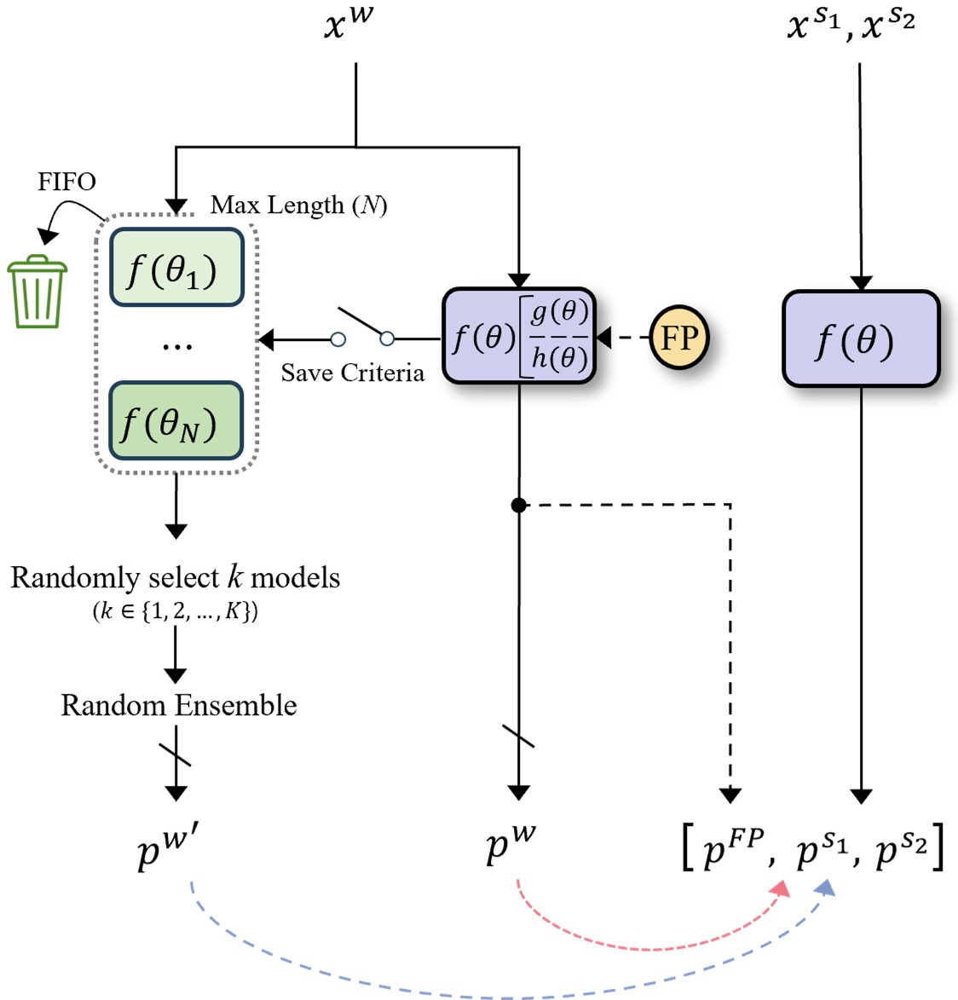

# PrevMatch: Revisiting and Maximizing Temporal Knowledge in Semi-supervised Semantic Segmentation

[](https://paperswithcode.com/sota/semi-supervised-semantic-segmentation-on-22?p=revisiting-and-maximizing-temporal-knowledge)
[](https://paperswithcode.com/sota/semi-supervised-semantic-segmentation-on-2?p=revisiting-and-maximizing-temporal-knowledge)
[](https://paperswithcode.com/sota/semi-supervised-semantic-segmentation-on-1?p=revisiting-and-maximizing-temporal-knowledge)
[](https://paperswithcode.com/sota/semi-supervised-semantic-segmentation-on-21?p=revisiting-and-maximizing-temporal-knowledge)
[](https://paperswithcode.com/sota/semi-supervised-semantic-segmentation-on-4?p=revisiting-and-maximizing-temporal-knowledge)
[](https://paperswithcode.com/sota/semi-supervised-semantic-segmentation-on-9?p=revisiting-and-maximizing-temporal-knowledge)
[](https://paperswithcode.com/sota/semi-supervised-semantic-segmentation-on-27?p=revisiting-and-maximizing-temporal-knowledge)
[](https://paperswithcode.com/sota/semi-supervised-semantic-segmentation-on-28?p=revisiting-and-maximizing-temporal-knowledge)
[](https://paperswithcode.com/sota/semi-supervised-semantic-segmentation-on-29?p=revisiting-and-maximizing-temporal-knowledge)
[](https://paperswithcode.com/sota/semi-supervised-semantic-segmentation-on-30?p=revisiting-and-maximizing-temporal-knowledge)
[](https://paperswithcode.com/sota/semi-supervised-semantic-segmentation-on-10?p=revisiting-and-maximizing-temporal-knowledge)
[](https://paperswithcode.com/sota/semi-supervised-semantic-segmentation-on-coco-2?p=revisiting-and-maximizing-temporal-knowledge)


This is the official PyTorch implementation for the paper "Revisiting and Maximizing Temporal Knowledge in Semi-supervised Semantic Segmentation".

**[[Arxiv]](https://arxiv.org/abs/2405.20610)**


## Overview
In semi-supervised semantic segmentation, the Mean Teacher- and co-training-based approaches are employed to mitigate confirmation bias and coupling problems. 
However, despite their high performance, these approaches frequently involve complex training pipelines and a substantial computational burden, limiting the scalability and compatibility of these methods.
In this paper, we propose a PrevMatch framework that effectively mitigates the aforementioned limitations by maximizing the utilization of the temporal knowledge obtained during the training process.
We directly utilize previous models to provide additional pseudo-label guidance, referred to as previous guidance, to the student network. 
In addition, we develop a highly randomized ensemble strategy that enhances the reliability and diversity of the previous guidance while minimizing the increase in computational complexity.




## Main Results

### Pascal VOC 2012
**Original protocol** whereby labeled images are exclusively sourced from the high-quality subset.

The ( ) indicates the performance of the reproduced checkpoints.

| ResNet-50 & DeepLabV3+      |  92  | 183  | 366  | 732  | 1464 |
| :-------------------------: | :--: | :--: | :--: | :--: | :--: |
| Supervised Baseline         | 44.0 | 52.3 | 61.7 | 66.7 | 72.9 |
| UniMatch     (CVPR'23)      | 71.9 | 72.5 | 76.0 | 77.4 | 78.7 |
| Dual Teacher (NIPS'23)      | 70.8 | 74.5 | 76.4 | 77.7 | 78.2 |
| **PrevMatch (ours)**        | 73.4 <br> [(73.7)](https://github.com/wooseok-shin/PrevMatch/releases/download/checkpoints/pascal_r50_92_73.7.pth) | 75.4 <br> [(75.9)](https://github.com/wooseok-shin/PrevMatch/releases/download/checkpoints/pascal_r50_183_75.9.pth) | 77.5 <br> [(78.0)](https://github.com/wooseok-shin/PrevMatch/releases/download/checkpoints/pascal_r50_366_78.0.pth) | [78.6](https://github.com/wooseok-shin/PrevMatch/releases/download/checkpoints/pascal_r50_732_78.6.pth) | 79.3 <br> [(79.6)](https://github.com/wooseok-shin/PrevMatch/releases/download/checkpoints/pascal_r50_1464_79.6.pth)|

| ResNet-101 & DeepLabV3+     |  92  | 183  | 366  | 732  | 1464 |
| :-------------------------: | :--: | :--: | :--: | :--: | :--: |
| Supervised Baseline         | 45.1 | 55.3 | 64.8 | 69.7 | 73.5 |
| AugSeg     (CVPR'23)        | 71.1 | 75.5 | 78.8 | 80.3 | 81.4 |
| UniMatch   (CVPR'23)        | 75.2 | 77.2 | 78.8 | 79.9 | 81.2 |
| **PrevMatch (ours)**        | 77.0 <br> [(76.9)](https://github.com/wooseok-shin/PrevMatch/releases/download/checkpoints/pascal_r101_92_76.9.pth) | 78.5 <br> [(79.0)](https://github.com/wooseok-shin/PrevMatch/releases/download/checkpoints/pascal_r101_183_79.0.pth) | 79.6 <br> [(79.8)](https://github.com/wooseok-shin/PrevMatch/releases/download/checkpoints/pascal_r101_366_79.8.pth) | [80.4](https://github.com/wooseok-shin/PrevMatch/releases/download/checkpoints/pascal_r101_732_80.4.pth) | [81.6](https://github.com/wooseok-shin/PrevMatch/releases/download/checkpoints/pascal_r101_1464_81.6.pth) |


### Cityscapes
| ResNet-50 & DeepLabV3+         | 1/16 | 1/8  | 1/4  | 1/2  |
| :----------------------------: | :--: | :--: | :--: | :--: |
| Supervised Baseline            | 63.3 | 70.2 | 73.1 | 76.6 |
| UniMatch      (CVPR'23)        | 75.0 | 76.8 | 77.5 | 78.6 |
| Diverse Co-T. (3-cps) (ICCV'23)|  -   | 76.5 | 78.5 |  -   |
| **PrevMatch (ours)**           | 75.8 <br> [(76.0)](https://github.com/wooseok-shin/PrevMatch/releases/download/checkpoints/cityscapes_r50_1_16_76.0.pth) | [77.8](https://github.com/wooseok-shin/PrevMatch/releases/download/checkpoints/cityscapes_r50_1_8_77.8.pth) | 78.8 <br> [(78.7)](https://github.com/wooseok-shin/PrevMatch/releases/download/checkpoints/cityscapes_r50_1_4_78.7.pth) | [79.2](https://github.com/wooseok-shin/PrevMatch/releases/download/checkpoints/cityscapes_r50_1_2_79.2.pth) |

| ResNet-101 & DeepLabV3+        | 1/16 | 1/8  | 1/4  | 1/2  |
| :----------------------------: | :--: | :--: | :--: | :--: |
| Supervised Baseline            | 66.3 | 72.8 | 75.0 | 78.0 |
| UniMatch      (CVPR'23)        | 76.6 | 77.9 | 79.2 | 79.5 |
| Diverse Co-T. (3-cps) (ICCV'23)| 75.7 | 77.4 | 78.5 |  -   |
| **PrevMatch (ours)**           | 77.7 <br> [(77.6)](https://github.com/wooseok-shin/PrevMatch/releases/download/checkpoints/cityscapes_r101_1_16_77.6.pth) | [78.9](https://github.com/wooseok-shin/PrevMatch/releases/download/checkpoints/cityscapes_r101_1_8_78.9.pth) | [80.1](https://github.com/wooseok-shin/PrevMatch/releases/download/checkpoints/cityscapes_r101_1_4_80.1.pth) | [80.1](https://github.com/wooseok-shin/PrevMatch/releases/download/checkpoints/cityscapes_r101_1_2_80.1.pth) |

We also provide [training logs](https://github.com/wooseok-shin/PrevMatch/tree/main/training_logs).


## Getting Started


### Environment & Requirements
```bash
cd PrevMatch
conda create -n prevmatch python=3.10.4
conda activate prevmatch
pip install -r requirements.txt
pip install torch==1.12.1+cu113 torchvision==0.13.1+cu113 --extra-index-url https://download.pytorch.org/whl/cu113
```

### Pretrained Weights of Backbone
Please download the weights file and put them under `pretrained` folder.

[ResNet-50](https://github.com/wooseok-shin/PrevMatch/releases/download/preliminary/resnet50.pth) | [ResNet-101](https://github.com/wooseok-shin/PrevMatch/releases/download/preliminary/resnet101.pth) | [Xception-65](https://github.com/wooseok-shin/PrevMatch/releases/download/preliminary/xception.pth)


### Setup Datasets

Please download the datasets and extract them to `./data/`.

- Pascal: [JPEGImages](http://host.robots.ox.ac.uk/pascal/VOC/voc2012/VOCtrainval_11-May-2012.tar) | [SegmentationClass](https://github.com/wooseok-shin/PrevMatch/releases/download/preliminary/ground_truth_pascal.zip)
- Cityscapes: [leftImg8bit](https://www.cityscapes-dataset.com/file-handling/?packageID=3) | [gtFine](https://github.com/wooseok-shin/PrevMatch/releases/download/preliminary/ground_truth_cityscapes.zip)
- COCO: [train2017](http://images.cocodataset.org/zips/train2017.zip) | [val2017](http://images.cocodataset.org/zips/val2017.zip) | [masks](https://github.com/wooseok-shin/PrevMatch/releases/download/preliminary/ground_truth_coco.zip)

The ground truths were preprocessed by [UniMatch](https://github.com/LiheYoung/UniMatch)

The final folder structure should look like this:
```
├── PrevMatch
	├── pretrained
		└── resnet50.pth, ...
	└── prevmatch.py
	└── ...
├── data
	├── pascal
		├── JPEGImages
		└── SegmentationClass
	├── cityscapes
		├── leftImg8bit
		└── gtFine
	├── coco
		├── train2017
		├── val2017
		└── masks
```


## Usage

### Training PrevMatch
We integrate AMP in our pipeline for training efficiency. If you don't want to use AMP, set amp to False in the config file.
And, we produced our results using 1 GPU for the Pascal VOC dataset and 2 GPUs for the other datasets.
So, you can reproduce the results using only 1 or 2 GPUs.

```bash
sh scripts/train_<dataset>.sh <num_gpu> <port> <splits>
# Pascal
# sh scripts/train_pascal.sh 1 11 92

# Cityscapes
# sh scripts/train_cityscapes.sh 2 11 1_16

# To train on other datasets, please modify ``dataset`` in the train_{}.sh script.
# For particularly large-scale datasets with numerous classes (COCO and ADE20k), you can adjust the conf_thresh or base_only_epoch parameters to fully reproduce the results.
```

### Evaluation
```bash
# sh cripts/evaluate.sh <dataset> <checkpoint path> <save_map=True/False>
sh scripts/evaluate.sh pascal checkpoints/pascal_92_73.7.pth True
```

### Inference on Custom Dataset
```bash
# sh cripts/inference.sh <custom dataset path> <dataset type> <checkpoint path> <save_map=True/False> <img_size>
sh scripts/inference.sh ../data/your_img_path/ pascal checkpoints/pascal_r50_92_73.7.pth True 500
```

## Citation
If you find this project useful, please consider citing:
```bibtex
@article{shin2024revisiting,
  title={Revisiting and Maximizing Temporal Knowledge in Semi-supervised Semantic Segmentation},
  author={Shin, Wooseok and Park, Hyun Joon and Kim, Jin Sob and Han, Sung Won},
  journal={arXiv preprint arXiv:2405.20610},
  year={2024}
}
```


## Acknowledgements
PrevMatch is based on [UniMatch](https://github.com/LiheYoung/UniMatch), [SemiVL](https://github.com/google-research/semivl), and [Diverse Co-training](https://github.com/williamium3000/diverse-cotraining). 
We are grateful to their authors for open-sourcing their code.

